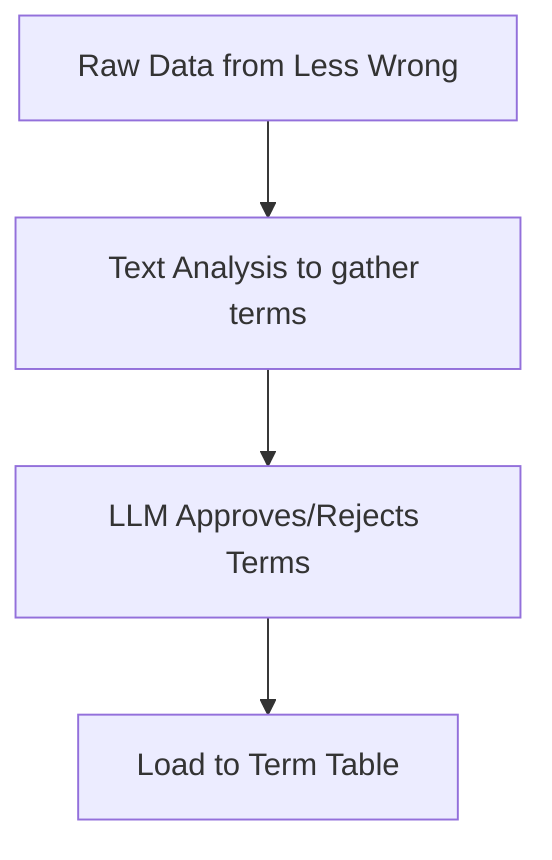

# Pipeline Overview

## Introduction
- We are building a reference tool of common terms (alignment, mechanistic interpretability etc.) in AI Safety and alignment.

## Pipeline Steps
<!-- Outline the key steps in the pipeline. Use subheadings for each step. -->
The pipeline will create the terms and relevant info across the following steps 
### Step 1: Gather Terms
- **Description**: Use the LessWrong API
- **Inputs**: 
- **Outputs**: 
- **Tools/Technologies Used**: 

| term_id | name | justification | definition | requires_review | llm_state |
|---------|------|---------------|------------|-----------------|-----------|
|         |      |               |            |                 |           |
|         |      |               |            |                 |           |

### Step 2: Term Enrichment
- **Description**: 
- **Inputs**: 
- **Outputs**: 
- **Tools/Technologies Used**: 

### Step 3: Tagging
- **Description**: 
- **Inputs**: 
- **Outputs**: 
- **Tools/Technologies Used**: 

### Step 4: Links
- **Description**: 
- **Inputs**: 
- **Outputs**: 
- **Tools/Technologies Used**: 

### Step 5: Heat Score
- **Description**: 
- **Inputs**: 
- **Outputs**: 
- **Tools/Technologies Used**: 

