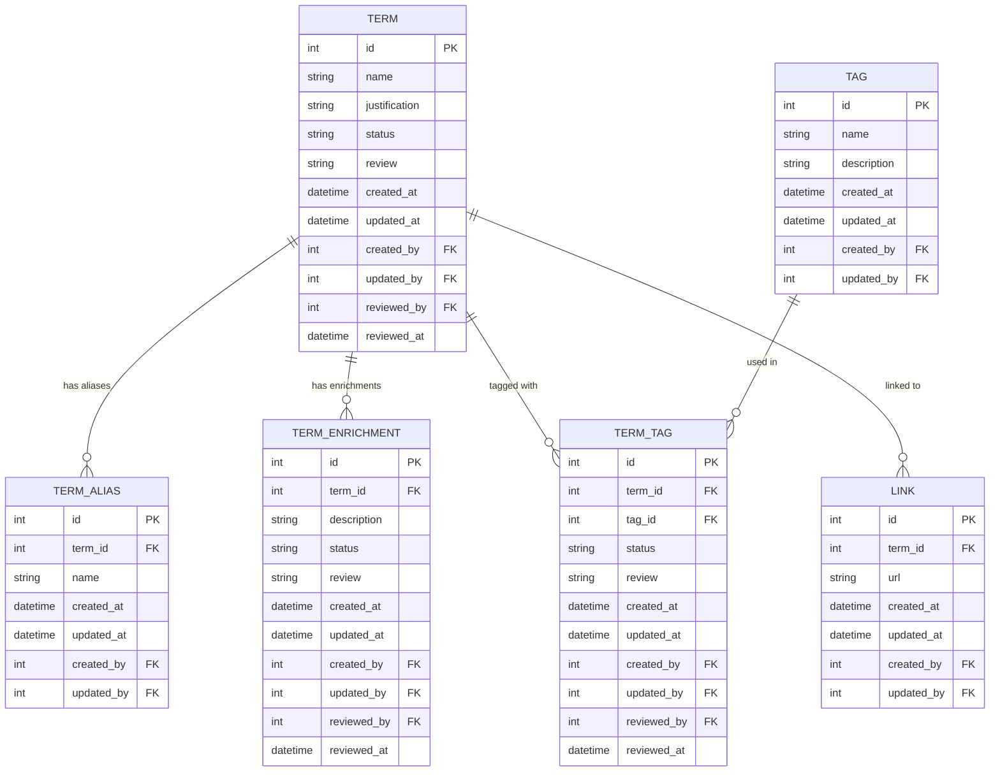

# Entity-Relationship Diagram

```mermaid
erDiagram
    TERM {
        int id PK
        string name
        string justification
        string status
        string review
        datetime created_at
        datetime updated_at
        int created_by FK
        int updated_by FK
        int reviewed_by FK
        datetime reviewed_at
    }
    TERM_ALIAS {
        int id PK
        int term_id FK
        string name
        datetime created_at
        datetime updated_at
        int created_by FK
        int updated_by FK
    }
    TERM_ENRICHMENT {
        int id PK
        int term_id FK
        string description
        string status
        string review
        datetime created_at
        datetime updated_at
        int created_by FK
        int updated_by FK
        int reviewed_by FK
        datetime reviewed_at
    }
    TAG {
        int id PK
        string name
        string description
        datetime created_at
        datetime updated_at
        int created_by FK
        int updated_by FK
    }
    TERM_TAG {
        int id PK
        int term_id FK
        int tag_id FK
        string status
        string review
        datetime created_at
        datetime updated_at
        int created_by FK
        int updated_by FK
        int reviewed_by FK
        datetime reviewed_at
    }
    LINK {
        int id PK
        int term_id FK
        string url
        datetime created_at
        datetime updated_at
        int created_by FK
        int updated_by FK
    }

    TERM ||--o{ TERM_ALIAS : "has aliases"
    TERM ||--o{ TERM_ENRICHMENT : "has enrichments"
    TERM ||--o{ TERM_TAG : "tagged with"
    TAG ||--o{ TERM_TAG : "used in"
    TERM ||--o{ LINK : "linked to"
```
